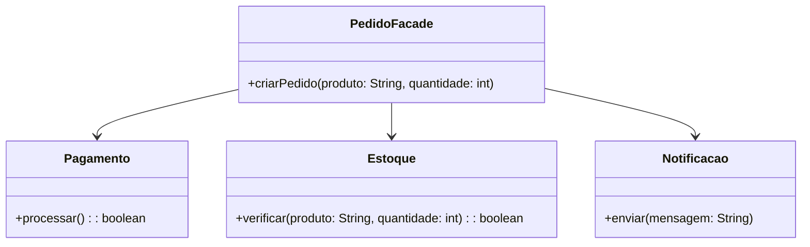

# Facade Padrão: Simplificação do Sistema de Pedido

## Motivação
Em sistemas complexos, a interação entre diversos subsistemas pode ser complicada e difícil de gerenciar. O padrão de projeto **Facade** propõe a criação de uma interface única para simplificar o acesso a um conjunto de funcionalidades.

Neste exemplo, utilizamos o **Facade** para simplificar a lógica de um sistema de pedidos, que envolve múltiplos subsistemas, como processamento de pagamento, estoque e notificações.


## UML do Facade 




## Código do Facade

### Interface PedidoFacade
```java
package facade;

public class PedidoFacade {
    private Pagamento pagamento;
    private Estoque estoque;
    private Notificacao notificacao;

    public PedidoFacade() {
        this.pagamento = new Pagamento();
        this.estoque = new Estoque();
        this.notificacao = new Notificacao();
    }

    public void criarPedido(String produto, int quantidade) {
        if (estoque.verificar(produto, quantidade)) {
            if (pagamento.processar()) {
                notificacao.enviar("Pedido realizado com sucesso!");
            }
        }
    }
}
```

### Implementação dos Subsistemas

#### Pagamento
```java
package facade;

public class Pagamento {
    public boolean processar() {
        System.out.println("Pagamento processado com sucesso.");
        return true;
    }
}
```

#### Estoque
```java
package facade;

public class Estoque {
    public boolean verificar(String produto, int quantidade) {
        System.out.println("Estoque verificado para " + produto + " (Quantidade: " + quantidade + ")");
        return true;
    }
}
```

#### Notificação
```java
package facade;

public class Notificacao {
    public void enviar(String mensagem) {
        System.out.println("Notificação enviada: " + mensagem);
    }
}
```


### Implementação do Cliente (Main)
```java
package facade;

public class Main {
    public static void main(String[] args) {
        PedidoFacade pedidoFacade = new PedidoFacade();
        pedidoFacade.criarPedido("Notebook", 1);
    }
}
```

## Explicação do Código
1. **Criamos um PedidoFacade** que encapsula a complexidade dos subsistemas Pagamento, Estoque e Notificacao.
2. **Cada subsistema** realiza sua função de forma independente.
3. **O cliente (Main)** interage apenas com a interface do PedidoFacade, sem precisar lidar diretamente com os detalhes internos do sistema.


## Participantes

- **Facade (PedidoFacade)**
  - Fornece uma interface simplificada para o cliente interagir com o sistema.

- **Subsistemas (Pagamento, Estoque, Notificacao)**
  - Executam tarefas específicas e são encapsulados pelo Facade.

- **Cliente (Main)**
  - Utiliza apenas o Facade para interagir com o sistema, sem conhecer detalhes internos.
